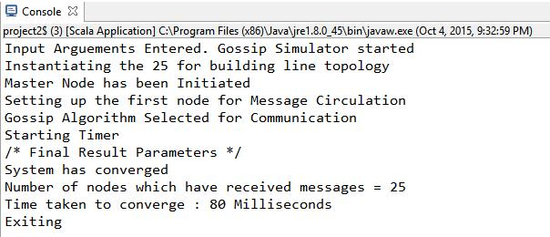
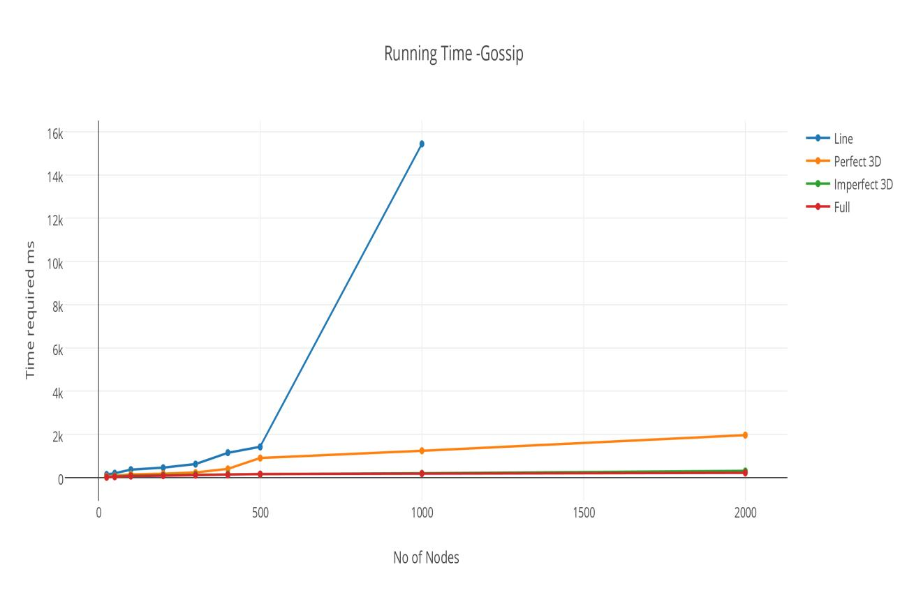
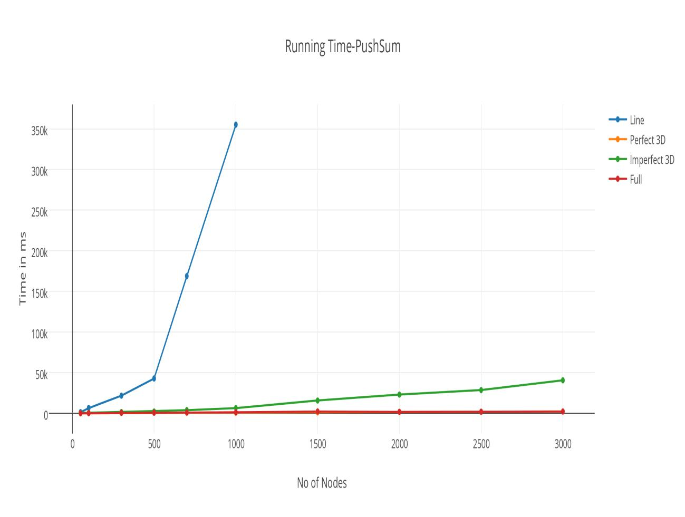
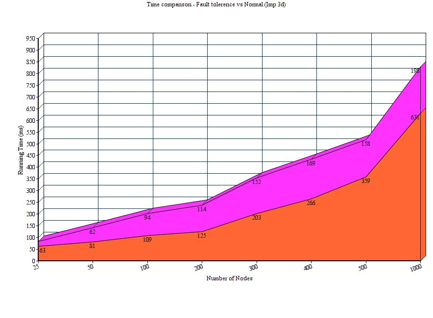

# **Gossip Simulator**

Gossip Simulator is an implementation on Gossip and Push sum algorithm, with failure tolerence for multiple nodes. Gossip and push sum are communication protocols for distributed systems. You can read more about Gossip algorithm [here](https://en.wikipedia.org/wiki/Gossip_protocol) and about Push sum [here](www.inf.fu-berlin.de/lehre/WS11/Wireless/Lectures/lecture13.pdf). The project is implemented in scala and Akka.
Code for gossip and push sum can be found in the gossip-sum directory. The code for those algorithms with failure tolerence can be found in the gossip-sum-tpl directory.

To run the project type the following command in terminal:
	sbt "run <number of nodes> <topology> <algorithm>"

The topology can be:
1) Line
2) Full (Fully connected)
3) 3d
4) imp3d

The algorithms can be:
1) gossip
2) pushsum

Number of nodes can be any Integer value.

## **Results**

*Fig. 1. Shows the output parameters for a test run.*

*Fig. 2. Shows the runtime for Gossip protocol vs Number of Nodes in the network graph.*

*Fig. 3. Shows the runtime for Push Sum protocol vs Number of Nodes in the network graph.*

*Fig. 4. Time comparison between network with fault tolerance vs Normal network for 3D topology*

## **Insights**

From both these above graphs it can be concluded that:
1. Topologies such as Imperfect 3D and Full topology are better at message propagation as
compared to Line and 3D.

2. Execution in case of Gossip is dependent on the maximum number of transmitted message per
node.

3. As compared to Gossip algorithm the push sum algorithm is faster since in push sum we need
only one node for the convergence for which the (S/W) ration does not change significantly (10^-
10) for 3 continuous iteration.

4. For line topology it is highly probable that the dead node may entirely stop the message
passing, as it can split the topology. (The dead node can be a single point of failure).

5. For other topologies such as Full, 3D, Imperfect 3D It will slow down the message propagation
in the topology. The propagation delay increase with the number of failure nodes.

